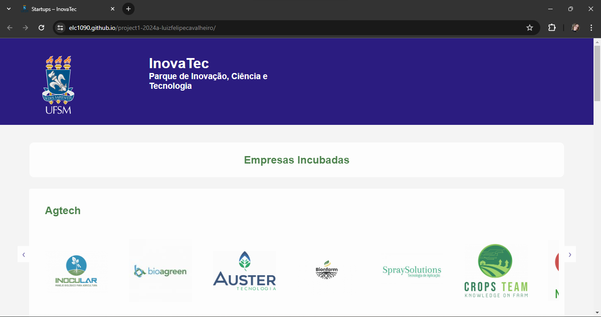
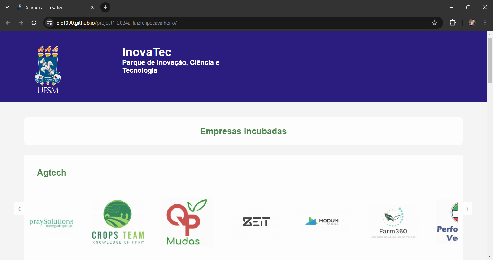
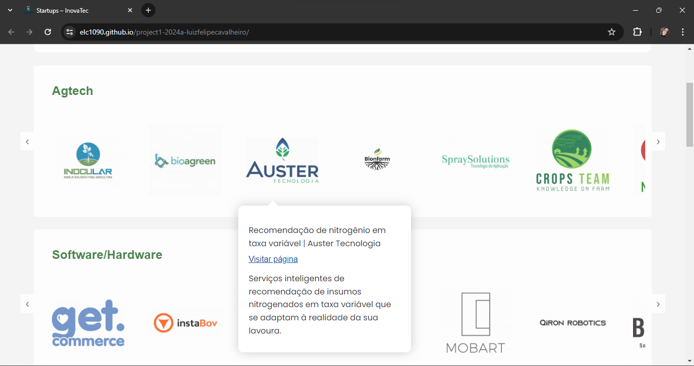
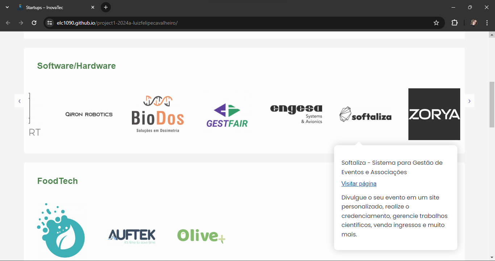
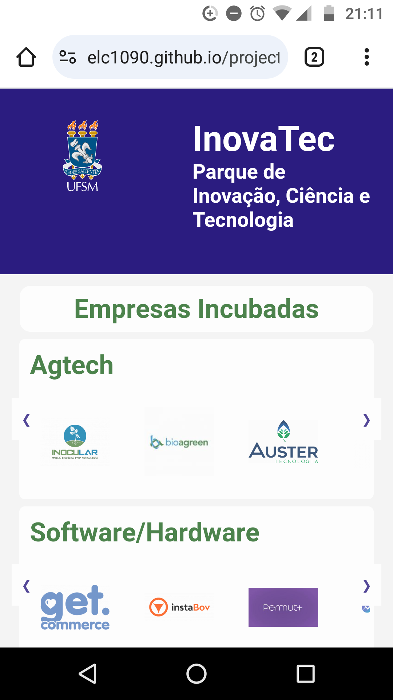
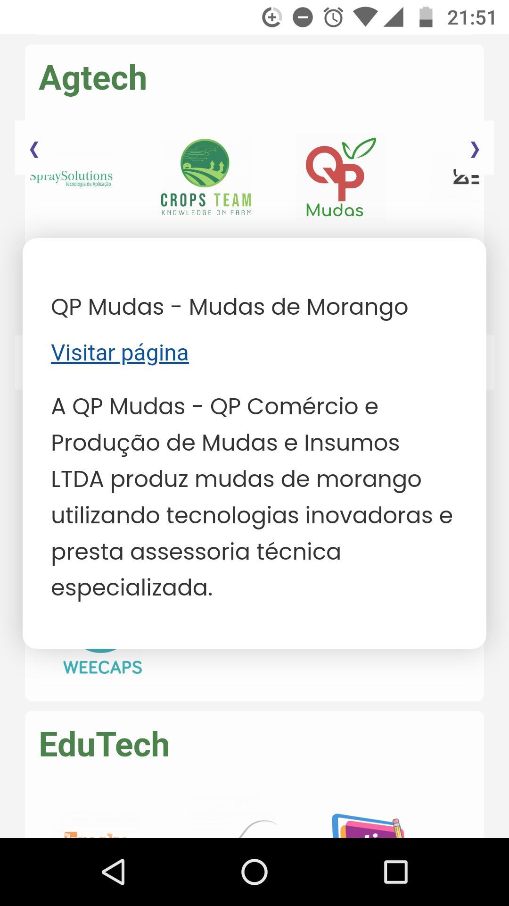

# Projeto: Remake de site/app web

Acesso: https://elc1090.github.io/project1-2024a-luizfelipecavalheiro/

#### Desenvolvedor
Luiz Felipe Cavalheiro - Ciência da Computação

#### Site/app escolhido

##### Link
https://www.ufsm.br/orgaos-suplementares/inovatec/startups

##### Descrição

O site possui um design simplista, pois não há muito contraste na página, as cores utilizadas nos heading
são semelhantes, porém, seu código é extenso e complexo, contendo várias referências a arquivos CSS e scripts em JavaScript, além de inúmeras divs que vão moldando o design do site. A página apresenta pouca interação com o usuário e nehuma informação prévia sobre as empresas, há apenas o redirecionamento para a homepage de daquelas que possuem este recurso. As divs, contém seu estilo próprio e especificidades, o CSS
é extenso, utilizando inúmeros recursos de estilização. Algumas empresas, não possuem página vinculada a sua imagem, no site original, portanto as imagens não possuem nenhuma âncora que leve a página da empresa, são elas:

- Agtech:
    - SpraySolutions;
    - Modum do Brasil;
    - Farm360;
    - Performance Vegetal;
    - Bion;

- Software/Hardware:
    - Permut+;
    - Chartei;
    - Biodos;
    - Engesa;
    
- FoodTech:
    - Olive;
    
- Edutech:
    - Kreska;
    - Colina;
    - e-tics;
    
- Saas:
    - Motorhub;

#### Desenvolvimento

A ideia do remake foi criar carrosseis nos segmentos que possuem mais empresas incubadas, evitando assim
que o usuário necessite usar a scrollbar para encontrar as logos. A ordem de amostragem dos segmentos, foram selecionados de forma decrescente em relação a quantidade de empresas, evitando a sensação de sobrecarga do usuário por ainda haver muitas empresas para conhecer, conforme vai descendo na scrollbar. Além disso, foram visitadas as páginas das empresas através de um scrapper feito em Python e os dados foram armazenados e posteriormente transformados em divs no arquivo HTML pelo próprio scrapper, essas divs representam popups que, após o clique na logo, são abertos e apresentam informações sobre a respectiva empresa, oferecendo um ganho de tempo ao usuário que não necessita visitar a página da empresa para descobrir mais sobre ela. A abertura, posicionamento e fechamento dos popups são controlados por um código em JavaScript. Além disso, ao clicar na imagem utilizando dispositivo mobile ou apenas passando o cursor por cima da logo na versão desktop, as imagens são ampliadas, ganhando um destaque maior. O design da página, por sua vez, caracteriza-se como clean, dando maior destaque às empresas, pensando na grande diversidade de logos que apresentam cores diversas e que, caso o site apresentasse um design mais colorido, iriam concorrer e tirar a atenção das logos.

#### Tecnologias

- HTML
- CSS
- JavaScript
- Python

#### Ambiente de desenvolvimento

- VSCode
- Google Chrome
- Inspecionar (F12)

#### Visualização prévia do site

- Versão Desktop:

- Versão Mobile:

#### Referências e créditos

- **(Template)**: https://fonts.googleapis.com/css2?family=Poppins:wght@400;700&display=swap
- **(Template)**: https://cdnjs.cloudflare.com/ajax/libs/font-awesome/5.15.4/css/all.min.css
- **(Icon)**: https://www.ufsm.br/app/themes/ufsm/images/icons/favicon.ico
- **(ChatGPT)**: 
    > crie um web scrapper para mim pegar informaçoes de sites 
- **(ChatGPT)**:
    > me de um código html simples
- **(ChatGPT)**:
    > coloque um css bonito nisso aí
- **(Material)**: https://pt.stackoverflow.com/questions/489627/pop-up-extens%C3%A3o-chrome-cortando-texto
- **(Material)**: https://developer.mozilla.org/pt-BR/docs/Web/CSS/text-overflow
- **(Material)**: https://pt.stackoverflow.com/questions/292454/resolu%C3%A7%C3%A3o-tamanho-da-imagem-em-mobile-css-aumentar-height
- **(Material)**: https://comunidade.lojaintegrada.com.br/t/como-alterar-tamanho-da-imagem-no-mobile/57057
- **(Material)**: https://www.alura.com.br/artigos/centralizando-elementos-com-css?utm_term=&utm_campaign=&utm_source=adwords&utm_medium=ppc&hsa_acc=7964138385&hsa_cam=20946398532&hsa_grp=153091871930&hsa_ad=688089973825&hsa_src=g&hsa_tgt=dsa-2258482179723&hsa_kw=&hsa_mt=&hsa_net=adwords&hsa_ver=3&gad_source=1&gclid=Cj0KCQjw8J6wBhDXARIsAPo7QA854fmiU8iizPSVqZcHbnXH5mYZs3OsgR26xFkce-jVZ82oH--1NaUaAom3EALw_wcB
- **(Material)**: https://pt.stackoverflow.com/questions/32936/reduzir-o-tamanho-de-uma-imagem-e-manter-a-propor%C3%A7%C3%A3o-com-css
- **(Material)**: https://cursos.alura.com.br/forum/topico-pagina-nao-fica-100-da-pagina-barra-de-scroll-274515

---
Projeto entregue para a disciplina de [Desenvolvimento de Software para a Web]**(http://github.com/andreainfufsm/elc1090-2024a) em 2024a